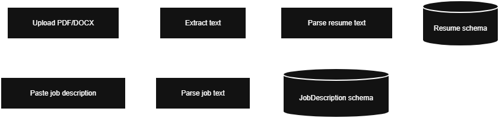
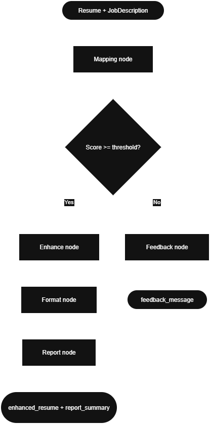

## Resume Enhancer – AI‑Powered Resume Personalization

### 1. Business‑Oriented Summary

**Problem.** Junior to mid-level job candidates struggle to create effective, role-specific CVs because they lack visibility into recruiter and ATS priorities, rely on guesswork when tailoring content, and face high cognitive and time costs when rewriting their resumes.

**Solution.** This project is a **resume personalization assistant** that:

- Takes a candidate’s resume and a target job description.
- Structures both into **clean, validated CV and job schemas**.
- Uses an LLM workflow to **compare** the candidate profile with role requirements.
- **Rewrites** resume sections to highlight relevant experience **without inventing facts**.
- Produces a **transparent change report** so the candidate can see and control every modification.
- Lets the user **export the final CV as PDF or DOCX** in one click.

**Who it’s for.**

- **Job seekers** Junior to mid-level job candidates who struggle to structure their CVs and clearly communicate relevant skills

**Key values**

- **Accuracy over flash** – strictly grounded in the original resume; the system refuses to fabricate experience, dates, or technologies.
- **Explainable AI** – every enhancement is backed by a comparison between the job description and CV, with a human‑readable report and skill match/gap summary.


---

### 2. Architecture Overview (Technical)

At a high level, the system follows the pipeline:

> **Structure → Reason → Rewrite → Review → Render**

#### 2.1 High‑Level Components

- **Backend (`app/`)**
  - FastAPI application hosting:
    - Parsing endpoints (resume + job description).
    - Enhancement endpoints (mapping + rewriting).
    - Export endpoints (PDF/DOCX).
  - LangChain / LangGraph‑based workflow for AI reasoning.

- **Front‑end (`cv_app_project/`)**
  - Streamlit application providing:
    - Resume upload + job description input.
    - Real‑time progress and results.
    - Side‑by‑side view of personalized CV and change report.
    - Skill match and gap badges.

- **Shared contracts**
  - Pydantic models in `app/schemas/` define the **single source of truth** for:
    - `Resume`, `Experience`, `Education`, `Skill`, `Project`, `Certification`, `Language`, etc.
    - `JobDescription` and `MappingResult`.
  - All AI prompts and renderers consume these schemas.

#### 2.2 AI Flow: Parsing and Enhancement

The system has two main AI flows: **parsing** (turn raw inputs into structured data) and **enhancement** (compare resume vs job and rewrite sections). The flowcharts below summarize them.

**Parsing flow** (POST `/api/v1/parse`)

Resume file (PDF/DOCX) and raw job description text are turned into validated `Resume` and `JobDescription` schemas. Text extraction is deterministic; structuring is done by the LLM.



**Enhancement flow** (POST `/api/v1/enhance`)

Given structured `Resume` and `JobDescription`, the LangGraph workflow runs mapping, then either returns feedback (low alignment) or enhances all sections, formats the result, and generates a change report.



- **Mapping** – Compares resume and job; produces match score, matched skills, and gaps.
- **Feedback** – When score is below `SCORE_THRESHOLD`, returns guidance instead of rewriting.
- **Enhance** – Rewrites summary, experiences, education, skills, certifications, etc., using the LLM.
- **Format** – Assembles enhancement outputs into a single `enhanced_resume` schema.
- **Report** – Generates a human-readable `report_summary` of what changed and why.

#### 2.3 Enhancement Modes

The `/api/v1/enhance` endpoint supports three modes (via body `mode` or query `?mode=...`). They differ in how the enhance step runs and how the API responds.

| Mode | Behavior | Response type | Use case |
|------|----------|---------------|----------|
| **legacy** (default) | Full LangGraph run: mapping → enhance (or feedback) → format → report. All sections enhanced in one batch. | Single JSON response with final state | Scripts, testing, simple integrations |
| **incremental** | Same logical flow, but enhancement is streamed per section. Client receives Server-Sent Events (SSE): `mapping_start` / `mapping_complete`, then `section_start` / `section_delta` / `section_complete` for each section, then `complete` with full state. | SSE stream (`text/event-stream`) | Streamlit UI and any client that wants real-time progress and token-by-token or section-by-section updates |

- **Choosing a mode:** Use **legacy** for simple one-shot calls; use **incremental** when the client is a UI that should show progress.

### 3. Project Setup & Run Instructions

This section assumes:

- Python 3.11+ installed.
- A virtual environment (recommended).
- Access to at least one LLM provider (Gemini or OpenAI via OpenRouter).

#### 3.1 Clone and environment

```bash
git clone <your-repo-url>
cd "Resume Enhancer Team D"
python -m venv .venv
source .venv/bin/activate  # On Windows: .venv\Scripts\activate
```

#### 3.2 Backend dependencies

From the project root:

```bash
pip install -r requirements.txt
```

#### 3.3 Backend configuration

1. Copy the example environment:

   ```bash
   cd app
   cp env.example .env  # On Windows: copy env.example .env
   cd ..
   ```

2. Edit `app/.env` and set (at minimum):

   - `APP_NAME`, `APP_VERSION`
   - One of:
     - `GOOGLE_API_KEY`, `GEMINI_LLM_MODEL`
     - or `OPENAI_API_KEY`, `OPENAI_LLM_MODEL` (for OpenRouter).
   - Optional:
     - `SCORE_THRESHOLD` and any logging or environment toggles defined in `core/config.py`.

#### 3.4 Run the FastAPI backend

From the project root:

```bash
cd app
uvicorn main:app --reload --host 0.0.0.0 --port 8000
```

The API will be available at `http://localhost:8000`:

- `http://localhost:8000/health` – health check.
- `http://localhost:8000/docs` – Swagger UI for `/api/v1/parse`, `/api/v1/enhance`, `/api/v1/export/*`.

You can also use the provided helper scripts (`run_server.bat` / `run_server.sh`) if you prefer.

#### 3.5 Front‑end (Streamlit) dependencies

In a second terminal, from the project root:

```bash
cd cv_app_project
pip install -r requirements.txt
```

If there is a `.env.example` in `cv_app_project/`, you can copy it to `.env` and set any UI‑specific configuration (e.g. API base URL) as needed.

#### 3.6 Run the Streamlit app

It is recommended to isolate the Streamlit UI in its **own virtual environment**, especially if you are experimenting with UI‑specific packages.

From the project root:

```bash
cd cv_app_project
python -m venv .venv
source .venv/bin/activate  # On Windows: .venv\Scripts\activate
pip install -r requirements.txt
```

With the backend already running and the Streamlit venv activated:

```bash
cd cv_app_project
streamlit run app.py
```

Then open the URL shown in the terminal (typically `http://localhost:8501`).

From there, a typical user flow is:

1. **Upload** a resume (PDF/DOCX).
2. **Paste** a target job description.
3. **Run** parsing + enhancement.
4. **Review**:
   - Personalized CV preview.
   - Change report (what changed and why).
   - Matched skills and gaps.
5. **Export** the enhanced resume as PDF or DOCX.

This setup gives you a fully working end‑to‑end system suitable for demos, academic evaluation, or as a foundation for a production‑grade resume personalization product.

